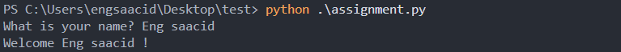
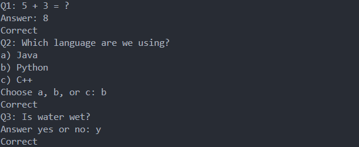
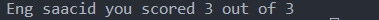

## 1-Greeting

* code
```python  
name = input("What is your name? ")
print("Welcome", name, '!')

```

* output
  



## 2-Questions

```python
score = 0

# quest-1
print("Q1: 5 + 3 = ?")
# expected answer 8
ans1 = input("Answer: ")

if ans1 == "8":
    print("Correct")
    score += 1
else:
    print("Wrong")


print("Q2: Which language are we using?")
print("a) Java")
print("b) Python")
print("c) C++")
# expected answer b, python.
ans2 = input("Choose a, b, or c: ").lower()

if ans2 == "b":
    print("Correct")
    score += 1
elif ans2 == "python":
    print("Correct")
    score += 1
else:
    print("Wrong")

print("Q3: Is water wet?")
# expected answer yes, or y or Y or YES
ans3 = input("Answer yes or no: ").lower()

if ans3 == "yes" or ans3 == "y" or ans3 == "Y" or ans3 == "YES":
    print("Correct")
    score += 1
else:
    print("Wrong")
```

* output
  



  ## 3- final message : score and name

  
  


